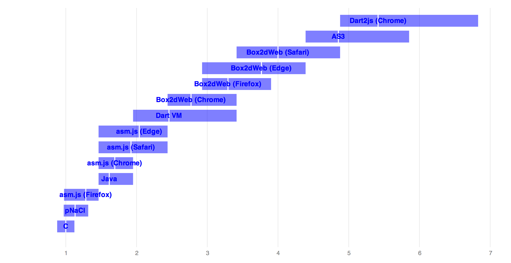

## What is this?

A simple VM performance benchmark suite that attempts to guage the performance of various VMs on a real-world
workload using the Box2D (http://box2d.org/) physics library. This library is particularly suited to benchmarking
VM performance because it's compute-intensive, often a real-world performance bottleneck in games, and has been
ported to many languages. You can find more background [here](http://j15r.com/blog/2011/12/15/Box2D_as_a_Measure_of_Runtime_Performance),
[here](http://j15r.com/blog/2013/04/25/Box2d_Revisited), and [here](http://j15r.com/blog/2013/07/05/Box2d_Addendum).

### Current results (as of 5 June 2016):

|                           | ms/frame | 5th %ile | 95th %ile | Ratio to C |
|---------------------------|----------|----------|-----------|------------|
|C (clang-500.2.79)         | 2.05     | 1.80     | 2.30      | 1.00       |
|pNaCl                      | 2.32     | 1.99     | 2.70      | 1.13       |
|asm.js (Firefox 46)        | 2.63     | 2.00     | 3.00      | 1.28       |
|Java (1.8)                 | 3.31     | 3.00     | 4.00      | 1.62       |
|asm.js (Chrome 51)         | 3.47     | 3.00     | 4.00      | 1.69       |
|asm.js (Safari 9.1)        | 3.94     | 3.00     | 5.00      | 1.92       |
|asm.js (MS Edge) (\*)      | 4.18     | 3.00     | 5.00      | 2.03       |
|Dart VM (1.16)             | 5.04     | 4.00     | 7.00      | 2.46       |
|Box2dWeb (Chrome 51)       | 5.68     | 5.00     | 7.00      | 2.77       |
|Box2dWeb (Firefox 46)      | 6.75     | 6.00     | 8.00      | 3.29       |
|Box2dWeb (MS Edge) (\*)    | 7.72     | 6.00     | 9.00      | 3.77       |
|Box2dWeb (Safari 9.1)      | 8.20     | 7.00     | 10.0      | 4.00       |
|AS3                        | 9.95     | 9.00     | 12.0      | 4.85       |
|Dart2js (Chrome 51)        | 11.1     | 10.0     | 14.0      | 5.42       |

[Test platform: MacBook Pro, 2.3 GHz i7, 16G memory, Mac OS X 10.11.5, Windows 10.
 All platform and compiler versions are latest unless otherwise specified.]

(*) I don't have any easy way to run Windows natively on my Mac (I'm not going
to setup dual boot partitions just for this benchmark), so I had to try and
back out IE10 numbers using Parallels. I calculated a performance penalty
ratio by running the Javascript benchmarks on Chrome/Mac and Chrome/Win (VM)
(`7.73ms / 5.68ms = 1.36x`), then used that to adjust the MS Edge numbers.
There are all sorts of things that could be wrong with this, but I expect it
at least gives us a rough idea.

  

  Scaled to multiples of native performance. The white line denotes the mean,
  and the edges of   the box denote the 5th and 95th %iles.

### Notes since last time

- Update C code to Box2D_2.3.1.
- Removed Crossbridge, as it's getting kind of long in the tooth and I don't really feel like building it.
- Removed the asm.js build in /c, because there's a maintained js port available that's already compiled.
- Removed Dartium, as it no longer exists (the Dart VM fills this role now).
- AS3 is a bit slower (on Chrome) than last time, possibly because it's been changed from an NPAPI plugin to Pepper.
- Added box2d-html5 (https://github.com/mvasilkov/box2d-html5) to the js benchmarks, but it's significantly slower
  than the old one, so I didn't bother adding it to the benchmarks.

### Old Results:

[5 July 2013](2013.07.05/results.md)
[15 March 2014](2013.07.05/results.md)

### Mini FAQ:

- But physics library (X) outperforms Box2D on platform (Y)!
  - That's not the point. The point is to test *VM* performance by using a similar code base on different platforms.
- But Box2dweb is a crappy port of Flash code!
  - Feel free to improve it, or hand-port your own. I'll happily accept the patch.
    That said, the code's fairly straightforward, and I'd be surprised if manual tweaking of it made much of a difference.
- Why haven't you updated to Box2D 2.3?
  - Because there do not appear to be updated versions of Box2dWeb, the Flash port, and the Dart port. One of the real
    benefits of using Box2d for this benchmark is that the ports are pretty structurally similar to the original C++
    version.

## Test platforms:

- Mac OS X: I'm using this. It works well.
- Linux: Others use this. It seems to work, but I don't personally test it.
- Windows: Can probably be cajoled into working, but will likely take a lot of manual labor. I prefer to build on my
  Mac then use the output files directly on a Windows box without building them there.

## Required tools:

- GCC or Clang: If you're running these benchmarks, you should know how to get this.
- JDK: I believe any JDK after 1.5 will work; I'm using 1.8.
- NaCl SDK: https://developers.google.com/native-client/sdk/download
- Flex SDK: http://www.adobe.com/devnet/flex/flex-sdk-download.html
- Dart SDK and VM: http://www.dartlang.org/tools/sdk/
- Node.js and NPM: https://nodejs.org/

## Environment variables (largely to locate the above tools):

- `$FLEX_SDK`: Flex SDK directory (e.g., `/opt/flex_sdk_4.6`)
- `$NACL_SDK_ROOT`: Directory containing the NaCl SDK version you want to use (e.g., `/opt/nacl_sdk/pepper_49`)

## Targets:

- /c:
  - c: `make -f bench2d.mk; bench2d`
  - pnacl: `make -f bench2d.pnacl.mk; python httpd.py` (open http://localhost:5103/bench2d_nacl.html in Chrome -- it won't work from a file:// url)
- /java:
  - `ant run`
- /js:
  - `run-d8` (if you have V8's standalone shell)
  - Or open bench2d_run.html in your favorite browser
- /as3:
  - `./build` (open Bench2d.html in your favorite browser, or Bench2d.swf in the standalone Flash Player)
  - (There's also a version that uses the "Nape" physics library, but this is not relevent to VM benchmarking)
- /dart:
  - `pub update; dart bench2d.dart`
- /dart (dart2js):
  - `pub serve; open http://localhost:8080/bench2d.html`
- /nodejs
  - `npm install; node index.js` (NOTE: This isn't working at the moment, but isn't directly relevant to benchmarking)

## Future work

- Find or build a better Javascript port of Box2D.
- Find a way to automate the benchmarks.
- Make the timer resolution less bad.
- Benchmark .NET, Android's Java VM
